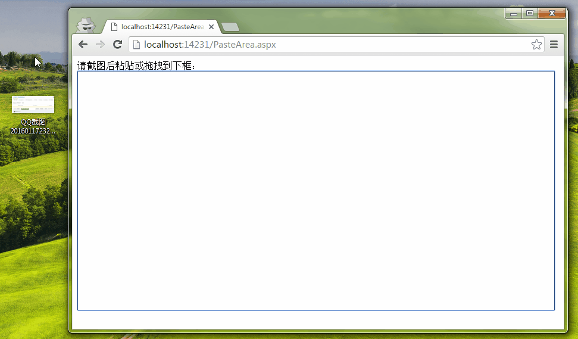

## 简单的Markdown 编辑器

##使用示例

###直接调用：
```javascript
                var md, show;
                show = document.querySelector("#show");
                md = new LucienMardown({
                    selector: "#box",
                    url: "../Upload"
                });
                md.subscribe(LucienMardown.OnImgLoaded, function () {
                    return show.innerHTML = md.getHtml();
                });
                md.subscribe([LucienMardown.OnInit, LucienMardown.OnIKeyup], function (md) {
                    return show.innerHTML = md.getHtml();
                });
                md.render();
```

###AMD/CMD
```javascript
	require(['LucienMarkdown'], function (LucienMardown) {
		var md, show;
		show = document.querySelector("#show");
		md = new LucienMardown({
			selector: "#box",
			url: "../Upload"
		});
        md.subscribe(LucienMardown.OnImgLoaded, function () {
            return show.innerHTML = md.getHtml();
        });
        md.subscribe([LucienMardown.OnInit, LucienMardown.OnIKeyup], function (md) {
            return show.innerHTML = md.getHtml();
        });
		md.render();
	})
   ```
   

##浏览器支持
当前版本只支持以下，浏览器，后期可能会支持更多浏览器，如ie10等。
* IE11
* Chrome
* FireFox
* Safari(未测式，理论应该支持)

## 运行

安装依赖：
`npm install`

运行开发
`gulp `

浏览器访问：`http://localhost:10000/markdown.html`


## 功能

* 代码高亮
* 退出保存
* 截图后直接粘贴上传。

* 拖拽上传



##原理

1. 粘贴上传   
处理目标容器（id）的paste事件，读取e.clipboardData中的数据，如果是图片进行以下处理：
用H5 File API(FileReader)获取文件的base64代码，并构建FormData异步上传。
2. 拖拽上传    
处理目标容器（id）的drop事件，读取e.dataTransfer.files（H5 File API: FileList）中的数据，如果是图片并构建FormData异步上传。
    


